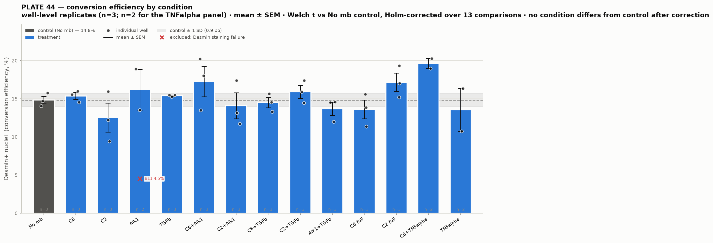

# New_Quantif_P44 — conversion efficiency, PLATE 44 (Tdiffs)

40 wells (B02–B11, C02–C11, D02–D11, E02–E11), 739,280 cells quantified.
Run from `Conversion_Efficiency/`. Every stage is resumable.

```
cpenv/Scripts/python.exe New_Quantif_P44/pilot_cellprob.py      # operating point
cpenv/Scripts/python.exe New_Quantif_P44/run_nuclei.py --cellprob 0
cpenv/Scripts/python.exe New_Quantif_P44/build_dbs.py
cpenv/Scripts/python.exe New_Quantif_P44/percell_desmin.py
cpenv/Scripts/python.exe New_Quantif_P44/confound_checks.py
cpenv/Scripts/python.exe New_Quantif_P44/treatment_summary.py   # needs the plate map
```

---

## Headline

**No condition differs from the `No mb` control after correction for multiple
comparisons (0 of 13).** One candidate is worth a follow-up rather than a claim:
**C6+TNFalpha, 19.6 % vs 14.8 % control (1.32×)** — both of its wells sit above
*every* control well, but it has **n = 2** and does not survive Holm correction
(p = 0.31).

| check | result | verdict |
|---|---|---|
| density confound | Pearson r = **+0.21** (p = 0.2) | clean — not the P28 artifact (r = 0.99) |
| plate-position trend | column r = −0.29, row r = +0.27 | mild, below the 0.4 flag |
| **control reproducibility** | `No mb` n=3: 14.1 / 14.7 / 15.7 % → **14.8 % ± 0.85 SD, CV 5.7 %** | **tight** — far better than Plate 9's 4.1× control spread |
| treatment reproducibility | replicate SD up to **3.96 pp** (C2: 9.4 / 12.2 / 16.0 %) | **this is what defeats the statistics** |
| significance | 0 of 13 conditions after Holm (Welch t, well as replicate) | no responder list |

The control is reproducible on this plate — which is a genuinely good result and
supersedes the provisional "spread is within noise" verdict recorded before the
plate map arrived (that used Plate 9's control spread as a stand-in yardstick
because P44 had no declared replicate structure). **The limiting factor is not
the control and not the segmentation; it is that several treatment conditions
disagree with themselves across replicate wells by more than any treatment
differs from control.**

---

## Plate map

Transcribed from the operator's layout sheet into `p44_layout.py`, which
self-checks that the map covers the 40 imaged wells exactly.

Rows B–E × columns 02–11, **conditions in triplicate running in reading order,
wrapping across rows** — `Alk1` is B11+C02+C03 and `C2+Alk1` is C10+C11+D02, so a
naive row-wise reading mis-assigns six wells. The last two conditions are
duplicates. 12 × 3 + 2 × 2 = 40 ✓

`No mb` (B02, B03, B04) is the **control**, n = 3. The pre-map position guess
(23_B02 = control) turned out to be right, but it is now read from the sheet
rather than assumed.

> **Sheet typo, transcribed not silently merged:** E08 reads `C6+TNFalpa`, E09
> reads `C6+TNFalpha`. Read as one condition; recorded in
> `SHEET_TYPO_NOTE`. Confirm if that is wrong — it is the top-ranked condition.

---

## This plate is a different acquisition — three traps

Verified read-only from OME metadata on **all 40** files; every well agrees.

| | PLATE_23/26/28/32 | **PLATE 44** |
|---|---|---|
| channel 0 | 561 (receptor) | **DAPI 429 nm (nuclei)** |
| channel 1 | 488 Desmin | 488 Desmin *(same)* |
| channel 2 | 405 DAPI (nuclei) | **AF546 571 nm (receptor)** |
| frame | 3636² | **1818²** |
| pixel | 0.650017 µm | **1.724571 µm** (2.65× coarser) |
| field | 2.36 mm (5.59 mm²) | **3.14 mm (9.83 mm²)**, 1.76× the area |
| depth | 16-bit | **12-bit** (max 4095) |

1. **Channels 0 and 2 are swapped.** Desmin is channel 1 on both, so running the
   old `--nuclei-ch 2` default would have produced a perfectly plausible myotube
   mask while segmenting the *receptor* channel as nuclei. Nothing in the output
   would have looked wrong. (Plate 9 shares this DAPI-first order.)
2. **Pixel size differs by 2.65×.** Every pixel-valued parameter is re-derived
   from its physical size in `p44_layout.py`, never copied: top-hat 26 µm =
   **disk(15 px)** here vs disk(40 px) there; ring 10 µm = **6 px** vs 15 px.
   Copying `40` across would have applied a 69 µm top-hat.
3. **Raw units are not cross-plate comparable** (12-bit, different acquisition),
   which is why the Desmin threshold is always re-derived from this plate's own
   pooled distribution. Standing rule, not a P44 exception. **Compare folds
   across plates, never absolute percentages.**

### Resolution was checked, not assumed
A 50–500 µm² nucleus is only 17–168 px here (118–1185 px on PLATE_2x), so
segmenting at native resolution needed justification. Cross-check on the control
well at the chosen operating point (`pilot_cellprob.json`):

| | valid nuclei | median area |
|---|--:|--:|
| native 1.72 µm/px | 17,759 | 157.6 µm² |
| resampled to 0.65 µm/px | 18,292 | 151.7 µm² |
| difference | **+3.0 %** | −3.7 % |

3 % agreement, and native is 5× faster with no interpolation → **native is used.**

---

## Operating point (fixed, plate-wide, data-driven)

Cellpose-SAM `cellprob = 0` · nucleus area 50–500 µm² · Desmin top-hat 26 µm
(disk 15 px, raw units) · 10 µm cytoplasmic ring (6 px) · pooled-Otsu threshold
**118.9 raw units** from P44's own 739,280 cells.

`cellprob = 0` was chosen by a 5-point sweep on four pilot wells spanning the
plate (B02, C07, D05, E11). **All four plateaued at 0, unanimously** — relative
neighbour sensitivity 0.002–0.008. Applied unchanged to all 40 wells; per-well
tuning is forbidden, and no threshold was chosen to make a number come out.

---

## Treatment results — replicate-averaged



The **well is the replicate unit**; means and intervals are across wells, never
across cells. Pooling ~18,000 cells per well would give absurdly tight intervals
that describe segmentation noise rather than biology. Conditions are drawn in the
**sheet's own order, not sorted by result**, so the figure does not manufacture a
ranking.

`d/ctrlSD` = distance from the control mean in units of the control's own
well-to-well SD. `separation` = do **all** wells of the condition fall outside the
full range of the three control wells — a statistic that uses no variance
estimate, which matters at n = 2–3.

| condition | n | mean | SD | SEM | fold | d/ctrlSD | p (Holm) | separation |
|---|--:|--:|--:|--:|--:|--:|--:|---|
| **No mb** (control) | 3 | **14.8 %** | 0.85 | 0.49 | 1.00× | +0.0 | — | — |
| C6 | 3 | 15.4 % | 0.76 | 0.44 | 1.04× | +0.6 | 1.000 | overlaps |
| C2 | 3 | 12.5 % | 3.28 | 1.89 | 0.84× | −2.7 | 1.000 | overlaps |
| Alk1 | 2 | 16.2 % | 3.80 | 2.68 | 1.09× | +1.6 | 1.000 | overlaps |
| TGFb | 3 | 15.4 % | 0.14 | 0.08 | 1.04× | +0.7 | 1.000 | overlaps |
| C6+Alk1 | 3 | 17.2 % | 3.42 | 1.98 | 1.16× | +2.8 | 1.000 | overlaps |
| C2+Alk1 | 3 | 14.1 % | 2.95 | 1.70 | 0.95× | −0.9 | 1.000 | overlaps |
| C6+TGFb | 3 | 14.5 % | 1.17 | 0.68 | 0.98× | −0.4 | 1.000 | overlaps |
| C2+TGFb | 3 | 15.9 % | 1.48 | 0.85 | 1.07× | +1.3 | 1.000 | overlaps |
| Alk1+TGFb | 3 | 13.7 % | 1.47 | 0.85 | 0.92× | −1.3 | 1.000 | overlaps |
| C6 full | 3 | 13.6 % | 2.13 | 1.23 | 0.92× | −1.4 | 1.000 | overlaps |
| C2 full | 3 | 17.2 % | 2.07 | 1.20 | 1.16× | +2.8 | 1.000 | overlaps |
| **C6+TNFalpha** | **2** | **19.6 %** | 0.92 | 0.65 | **1.32×** | **+5.6** | 0.314 | **above all controls** |
| TNFalpha | 2 | 13.6 % | 3.96 | 2.80 | 0.91× | −1.5 | 1.000 | overlaps |

### How to read this
- **Nothing is significant.** With n = 2–3 wells and 13 comparisons, the design
  can only detect very large effects. *Absence of significance here is not
  evidence of absence* — it is mostly evidence of low power.
- **C6+TNFalpha is the one candidate.** 19.0 % and 20.3 % against controls of
  15.7 / 14.7 / 14.1 % — no overlap at all, 1.32×, and its two wells agree
  closely (SD 0.92). It is also the *only* condition with complete separation.
  That is a hypothesis worth another plate, not a result.
- **TNFalpha alone does not do it** (13.6 %, 0.91×), so if the C6+TNFalpha signal
  is real it is not a TNFalpha main effect. But TNFalpha alone has SD 3.96
  (10.8 % and 16.4 %), so this comparison is weak in both directions.
- **C6+Alk1 and C2 full both reach 1.16×** (+2.8 control SD) but their replicates
  straddle the control range — C6+Alk1's wells are 13.5 / 18.0 / 20.2 %.
- **Beware C2 (0.84×) and TGFb (SD 0.14).** C2's three wells span 9.4–16.0 %;
  TGFb's three agree to within 0.14 pp. The same protocol produced both, which is
  the clearest statement of how variable this plate's wells are.

---

## Per-well results

739,400 valid nuclei segmented → 739,280 with a measurable cytoplasmic ring.
Sorted by conversion; condition from the layout sheet.

| well | id | cells | Desmin+ | conversion | fold |
|---|---|--:|--:|--:|--:|
| 14_B11 | B11 | 14,474 | 653 | **4.5 %** | 0.29× |
| 16_B09 | B09 | 17,135 | 1,616 | 9.4 % | 0.60× |
| 58_E10 | E10 | 15,225 | 1,636 | 10.8 % | 0.68× |
| 51_E03 | E03 | 22,865 | 2,599 | 11.4 % | 0.72× |
| 34_C10 | C10 | 18,186 | 2,130 | 11.7 % | 0.74× |
| 38_D11 | D11 | 16,060 | 1,928 | 12.0 % | 0.76× |
| 15_B10 | B10 | 16,584 | 2,027 | 12.2 % | 0.78× |
| 35_C11 | C11 | 15,445 | 2,029 | 13.1 % | 0.83× |
| 45_D04 | D04 | 21,369 | 2,844 | 13.3 % | 0.85× |
| 33_C09 | C09 | 24,441 | 3,301 | 13.5 % | 0.86× |
| 27_C03 | C03 | 17,096 | 2,312 | 13.5 % | 0.86× |
| 52_E04 | E04 | 22,365 | 3,099 | 13.9 % | 0.88× |
| 21_B04 | B04 | 15,641 | 2,198 | 14.1 % | 0.89× |
| 41_D08 | D08 | 15,502 | 2,240 | 14.4 % | 0.92× |
| 40_D09 | D09 | 17,367 | 2,519 | 14.5 % | 0.92× |
| 46_D03 | D03 | 22,534 | 3,274 | 14.5 % | 0.92× |
| 19_B06 | B06 | 24,615 | 3,577 | 14.5 % | 0.92× |
| 39_D10 | D10 | 15,689 | 2,289 | 14.6 % | 0.93× |
| 22_B03 | B03 | 17,516 | 2,578 | 14.7 % | 0.94× |
| 53_E05 | E05 | 20,607 | 3,131 | 15.2 % | 0.97× |
| 29_C05 | C05 | 14,537 | 2,217 | 15.2 % | 0.97× |
| 28_C04 | C04 | 14,591 | 2,259 | 15.5 % | 0.98× |
| 30_C06 | C06 | 14,716 | 2,281 | 15.5 % | 0.98× |
| 18_B07 | B07 | 23,130 | 3,601 | 15.6 % | 0.99× |
| 50_E02 | E02 | 21,580 | 3,366 | 15.6 % | 0.99× |
| 44_D05 | D05 | 21,217 | 3,321 | 15.7 % | 0.99× |
| **23_B02** | **B02** | 17,758 | 2,795 | **15.7 %** | **1.00×** ← assumed control |
| 43_D06 | D06 | 15,077 | 2,399 | 15.9 % | 1.01× |
| 17_B08 | B08 | 16,832 | 2,686 | 16.0 % | 1.01× |
| 20_B05 | B05 | 22,975 | 3,676 | 16.0 % | 1.02× |
| 59_E11 | E11 | 14,738 | 2,409 | 16.4 % | 1.04× |
| 54_E06 | E06 | 19,864 | 3,382 | 17.0 % | 1.08× |
| 47_D02 | D02 | 15,951 | 2,773 | 17.4 % | 1.10× |
| 42_D07 | D07 | 16,707 | 2,908 | 17.4 % | 1.11× |
| 31_C07 | C07 | 20,875 | 3,763 | 18.0 % | 1.15× |
| 26_C02 | C02 | 17,066 | 3,223 | 18.9 % | 1.20× |
| 56_E08 | E08 | 19,313 | 3,664 | 19.0 % | 1.21× |
| 55_E07 | E07 | 21,160 | 4,091 | 19.3 % | 1.23× |
| 32_C08 | C08 | 21,582 | 4,364 | 20.2 % | 1.28× |
| 57_E09 | E09 | 18,895 | 3,830 | 20.3 % | 1.29× |

**Maximum effect is 1.29×.** For scale, PLATE_23's strongest wells reached
2.1–2.6× and PLATE_32's 1.67×.

### One technical outlier
**14_B11 (4.5 %) is almost certainly a failed well, not a biological result.**
Its background-subtracted Desmin p99 is **329** against 1,066–2,331 for every
other well on the plate — the Desmin channel is essentially empty. Its nucleus
count and background are normal, so this is a staining/acquisition failure in one
channel, not a dead well. Exclude it, or re-image.

---

## Files — format parity with `New_Quantif_P32`

Every P32 artifact has a P44 equivalent, produced by the same method:

| P32 artifact | P44 | note |
|---|---|---|
| `build_dbs.py` → `dbs_cache/` | ✅ | top-hat re-derived: 26 µm = disk(15 px) here |
| `percell_desmin.py` → `.png`/`.json` | ✅ | ring 10 µm = 6 px here |
| `percell_values_r10.0.npz` | ✅ | per-cell ring values, cached |
| `visualize_final.py` → `visualize_final.json` | ✅ | + `per_condition` block, since P44 has replicates |
| `<well>_percell_classified.png` | ✅ **×40** | same colour code: green Desmin, magenta = Desmin+ nucleus, blue = Desmin− |
| `conversion_summary_bar.png` | ✅ | same form (control first, treated ascending, %/fold labels) **+ SEM bars and per-well dots**, because P32 had one well per condition and P44 has 2–3 |
| `density_confound.py` → `.png` | ✅ | reports well-level *and* condition-level r |
| `multinucleation.json` / `_summary.png` / `<well>_multinuc_overlay.png` | ❌ | **see below** |

P44-only additions (this plate needed them):
- `p44_layout.py` — **the single source** of channel indices, pixel size, derived
  pixel parameters and the plate map. Import it; never re-type a constant. Run it
  directly to print the map and self-check it against the imaged wells.
- `pilot_cellprob.py` → `.json` — operating-point sweep + the native-vs-resampled
  resolution cross-check
- `run_nuclei.py` → `nuclei/` — P32 reused `../plate32_nuclei/`; P44 keeps its own
- `confound_checks.py` → `.png`/`.json` — adds the plate-position trend and the
  spread-vs-noise check to the density test
- `treatment_summary.py` → `.png`/`.json` — replicate means, SEM, Holm-corrected
  tests, complete-separation statistic. `--include-failures` puts B11 back in.

Masks, the dbs cache and the 40 per-well overlays are gitignored (regenerable,
~1 GB). Scripts, JSON and the four summary figures are tracked.

### The one gap: multinucleation
`multinuc_plate.py` needs `plate44_myotube/*_myotube_mask.npy` (ridge detection)
and traces fibres through `real_fusion.trace_fibres`, which hardcodes the
PLATE_2x pixel size. Both are fixable, but there is a **resolution limit that is
not**: `detect_myotubes` uses Sato `sigmas=(1, 2, 4)` px at 0.650 µm/px, i.e.
ridge scales of ~1.3–5.2 µm. At P44's **1.725 µm/px those scales are 0.75–3.0
px**, so the finest myotube features the detector was built to find are at or
below one pixel here.

This does **not** affect the conversion numbers above — nuclei are ~14 µm ≈ 8 px
and are comfortably resolved, which the +3.0 % native-vs-resampled cross-check
confirms. But fibre *tracing* would systematically miss thin tendrils, and
multinucleation depends on traced fibre identity and territory. Running it
anyway would produce numbers that look fine and undercount. **Say so before
running it, not after.**

## What would strengthen this plate
1. **More replicates on C6+TNFalpha** — it is the only condition with complete
   separation from control, and it has n = 2. A third and fourth well would
   settle it either way. Confirm the `C6+TNFalpa`/`C6+TNFalpha` typo first.
2. **Explain the treatment-replicate variance.** C2 spans 9.4–16.0 % while TGFb's
   three wells agree to 0.14 pp, under one protocol. If that is positional or
   handling-related it is fixable and would make the whole plate readable; the
   plate-position correlations are mild (|r| ≤ 0.29) so it is not a simple
   gradient.
3. **Re-image or formally drop 14_B11** (Desmin staining failure). It currently
   costs the Alk1 condition a third of its replicates.
